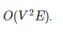

# MATA53 - Teória dos Grafos

Este repositório mantém o trabalho da disciplina MATA53 - Teória dos Grafos. Foi desenvolvido utilizando `Flask` + `Networkx` com hospedagem no `Heroku`


- Acesso ao site do projeto: [Projeto Graphs](https://projetographs.herokuapp.com/)

### Dinic's Algorithm - 

O algortimo Dinic tem como proposta solucionar o problema do [Fluxo Máximo](https://pt.wikipedia.org/wiki/Rede_de_fluxo#:~:text=O%20mais%20simples%20e%20mais,receptor%20em%20um%20gr%C3%A1fico%20dado.), onde dado um gráfico que representa uma rede de fluxo em que cada aresta tem uma capacidade. Também dados dois vértices fonte s e coletor t no gráfico, o fluxo máximo é é um fluxo com o maior valor possível de capacidade de s para t.


##### Complexidade:



##### Algoritmo:

A ideia principal do algoritmo é guiar os caminhos de aumento da fonte ao coletor usando um gráfico de nível.
Construa um gráfico de nível fazendo um [BFS](https://pt.wikipedia.org/wiki/Busca_em_largura) da fonte para rotular todos os níveis do gráfico de fluxo atual.
Se o coletor nunca foi alcançado durante a construção do gráfico de nível, pare e retorne o fluxo máximo.
Usando apenas arestas válidas no gráfico de nível, faça vários [DFS](https://pt.wikipedia.org/wiki/Busca_em_profundidade) de s -> t até que um fluxo de bloqueio, que é um fluxo em que todos os caminhos de s a t contêm pelo menos uma aresta saturada por esse fluxo, seja alcançado e some os valores de gargalo de todos os caminhos de aumento encontrados para calcular o fluxo máximo.


### Rodando projeto localmente -

Pré-requisitos: 
- Ter Python e Pip instalado na máquina

1. Instalar o `virtualenv`:
```
$ pip install virtualenv
```

2. Montar um  o `virtualenv`:
```
$ python -m  virtualenv env
```

3. : Iniciando o Ambiente virtual :
```
$  source env/bin/activate
```
ou
```
$  source .\env\Scripts\activate
```

4. Instalando as dependências:
```
$ (env) pip install -r requirements.txt
```

5. Inciando o projeto:
```
$ (env) python app.py

